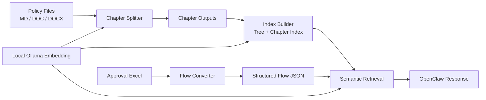

Latest release：https://github.com/yeelee87/PolicyRag/releases/latest
[PolicyRAG-Skill-Release-README.md](https://github.com/user-attachments/files/25619888/PolicyRAG-Skill-Release-README.md)
# PolicyRAG Skill
**Local-First RAG for Policy Documents and Approval Workflows**  
**面向制度文档与审批流程的本地化 RAG 技能**


PolicyRAG Skill turns policy files and approval spreadsheets into structured, searchable, and query-ready knowledge.  
PolicyRAG Skill 将制度文档与审批流程表转为结构化、可检索、可问答的知识系统。

---

## Release Highlights | 版本亮点

- Chapter-level splitting with directory-aware structure.
- Directory-tree indexing for stable policy retrieval.
- Excel-to-structured-flow conversion for approval processes.
- Semantic approval flow search with branch-aware results.
- Local embedding by default (Ollama), optimized for low-consumption runs.

- 按目录结构进行章节级拆分（只到章节）。
- 按目录树构建索引，制度检索更稳定。
- 审批 Excel 转结构化流程数据。
- 审批流程语义检索，支持分支结果。
- 默认本地 Ollama embedding，低消耗运行。

---

## Core Capabilities | 四大能力

| Capability | English | 中文 |
|---|---|---|
| Document Splitting | Split Markdown/Word documents by chapter and directory structure. | 按章节与目录结构拆分 Markdown/Word 文档。 |
| Policy Index & Retrieval | Build hierarchical indexes and retrieve policy content semantically. | 构建层级索引并进行制度语义检索。 |
| Excel Flow Conversion | Convert approval spreadsheets into structured flow JSON. | 将审批 Excel 转换为结构化流程 JSON。 |
| Approval Flow Search | Find approval paths and branch options via semantic matching. | 通过语义匹配检索审批路径及分支选项。 |

---


## Architecture | 架构图



---

## Quick Start | 快速开始

### 1) Environment Variables | 环境变量

```bash
export SKILL_ROOT="/path/to/PolicyRAG-Skill"
export RAG_DATA_DIR="${RAG_DATA_DIR:-$SKILL_ROOT/data}"
export RAG_FLOWS_DIR="${RAG_FLOWS_DIR:-$RAG_DATA_DIR/flows_v2}"
export RAG_INDEX_CACHE_DIR="${RAG_INDEX_CACHE_DIR:-$SKILL_ROOT/.cache/index}"
export RAG_EMBED_CACHE_DIR="${RAG_EMBED_CACHE_DIR:-$SKILL_ROOT/.cache/embed_cache}"
export OLLAMA_URL="${OLLAMA_URL:-http://localhost:11434}"
```

### 2) Environment Check | 环境检查

```bash
cd "$SKILL_ROOT"
python3 scripts/check_env.py
```

### 3) Split Documents | 文档分割

```bash
python3 scripts/rag_system.py split "/path/to/policy.docx" "./output"
```

### 4) Build Policy Index | 建立制度索引

```bash
python3 scripts/rag_system.py index "./output" "./index"
```

### 5) Search Policy | 制度检索

```bash
python3 scripts/rag_system.py search-docs "prepayment ratio rules" "./index"
```

### 6) Search Approval Flows | 审批流程检索

```bash
python3 scripts/search_flows.py "采购200万以上怎么审批" --flows-dir "$RAG_FLOWS_DIR"
```

---

## Typical Queries | 典型查询

- What is the approval path for purchases above 2 million?
- Which chapter defines prepayment constraints?
- Show all branches under this approval workflow.
- 采购 200 万以上怎么审批？
- 预付款比例限制在哪一章？
- 这个审批流程下有哪些分支？

---

## Project Structure | 项目结构

```text
PolicyRAG-Skill/
├── SKILL.md
├── README.md
├── openclaw-integration.md
├── FILE_CHANGES.md
└── scripts/
    ├── rag_system.py
    ├── search_flows.py
    ├── split_doc.py
    ├── convert_excel.py
    ├── index_manager.py
    └── check_env.py
```

---

## OpenClaw Integration | OpenClaw 集成

- Trigger by keywords like:
  - `检索制度`
  - `审批流程`
  - `文档拆分`
  - `转换审批表`
- Use scripts under `"$SKILL_ROOT/scripts"` for subagent tasks.
- Keep local Ollama running for embedding calls.

---

## Security & Privacy | 安全与隐私

- Local-first embedding by default.
- No mandatory external API for core retrieval pipeline.
- Suitable for private/internal policy repositories.

- 默认本地 embedding。
- 核心检索链路不强依赖外部 API。
- 适用于内部制度知识库场景。

---

## License | 许可

Internal use only.  
仅限内部使用。
